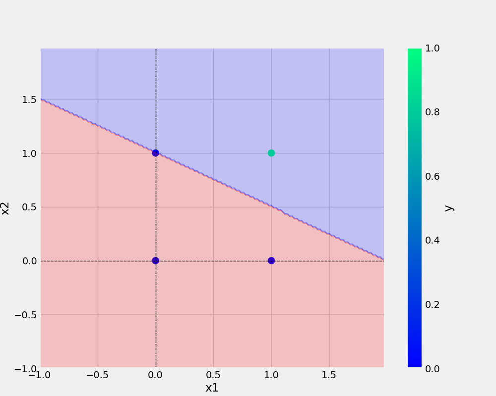

# oneNeuron
oneNeuron | perceptron


# commands used -


```bash
git add . && git commit -m "docstring updated" && git push origin main
```

```bash
cp Research\ notebooks/demo.ipynb .
```

## Add URL -
[Git handbook](https://guides.github.com/introduction/git-handbook/)

<a href="https://www.w3schools.com">Visit W3Schools.com!</a>

## Add image -



